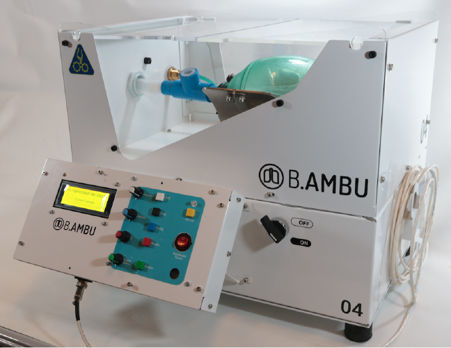
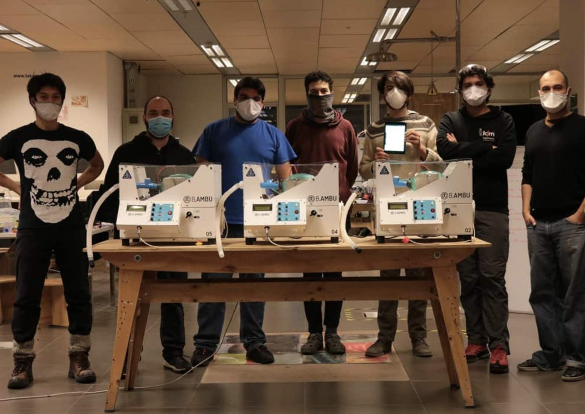

+++
layout = "post"
title = "B.AMBÚ "
langRef = "b-ambu"
summary = "University of Chile's Emergency Ventilator (COVID-19)"
thumbnail = "img/bambu_thumb.png"
date = 2020-05-08
+++

While confronting the raise of the pandemic in Chile, several institutions and organizations started depeloving their own alternatives to cope with respiratory therapy equipment stock break around the world. The University of Chile gathered a team of engineers, physicians and designers to create an emergency ventilator that could be produced with locally available parts only.

The result was **B.AMBÚ**, an AMBU-based, invasive mechanical ventilator design, that features autonomous volume-control mode, respiratory parameters monitorig (flow, pressure, PEEP, etc.) and alert systems when the patient or the device parameters leave optimal ranges, set by the medical teams.

